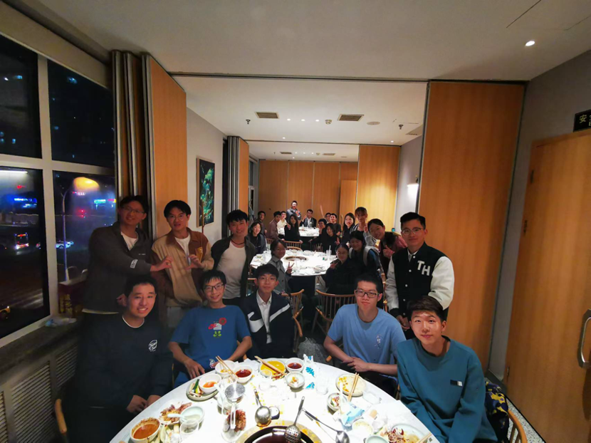
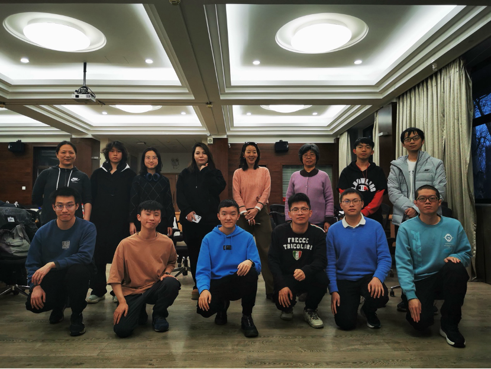

说来难以相信，自己竟然在合唱团待了整整6年，而作为团长或团长助理直接参与合唱团管理的时间也已经整整3年了。在团时间长带来的一大难题就是，有太多东西想写在这篇个人总结里面，相互之间也没有办法做取舍。其实作为团员的3年也充满着美好的回忆，但也许作为团长总结，我还是去多写一些近3年的事情吧。这篇文章会有点长，一方面要总结三年的合唱团走过的路程，让之后的同学们了解到合唱团曾经有过这样一段不寻常的故事，一方面也有在路程中我自己的感受、收获与成长。

## 新故事的开始

故事开端在大三春季学期刚刚结束的时候。那一学期因为保研、实习等等各种事情太忙，我几乎没有参加几次排练，唯一还留有的印象是一切尘埃落定后，去参加合唱团的期末聚餐。整个合唱团的人坐在一起，刚刚坐满一张圆桌。饭桌上，我意识到两件事情，一件事是姜指下学期要出国深造，这意味着我们下学期要迎来一位新指挥，要开始新的磨合阶段。而另一件事情是，合唱团现有的人员中，当时作为男高声部长的我似乎已经成了下一任团长的候选人之一。果然在几天后，龚团就微信联系了我关于合唱团后续工作的事情。

其实接下团长的担子之前犹豫了一阵，一方面我极少的几次社工经验都是给别人打工干杂活，从来没有涉及过管理和运行，自己并不确定自己是否能胜任团长的工作；另一方面，自己的本科前三年实在是过于疲惫，最后一年总想着好好休息一下，不想去做太多事情。但团长的工作总要有人来做，在合唱团待了三年，还是很喜欢在合唱团留下的回忆的，也许我也可以为这个团体做点什么。一番思考之后，我也就先答应了下来。那时的我肯定不会料到之后的几年会发生什么样的故事。

## 2021秋：紧张、迷茫

暑假转眼过去，新学期即将开始，遇到的第一个问题出现了：数来数去，上学期结束后团里就剩9个人了，有的声部连声部长都选不出来。迷茫了一阵之后我开始想办法，一方面东拼西凑，到处找之前曾经在合唱团的老团员们，把新学期的团员意向调查问卷顺着时间一直发到了我知道的最早的合唱团的大群，尝试把本科一起写大作业、打挑战杯的朋友们拉来合唱团，另一方面开始和龚团华哥计划新学期的招新。还记得那学期初给自己定下的目标：这学期要努力把大家留在合唱团里，让合唱团的人数恢复到我在2018年入团时的盛况。

清楚地记得自己第一次站在台上作为团长跟大家见面的那个场景。紧张、卑微、不自信，疯狂说错话，面对合唱团的担子仿佛一根软弱的苇草却要撑起磐石一般。在大学的前三年，自己似乎并没有意识到，自己在大家面前发言时竟然会紧张成这个样子。

新学期第一次活动的好坏会直接决定新团员之后会不会留下来，对于当时人数不多的合唱团来说是最重要紧迫的任务。为了准备招新，当时和龚团、华哥组织了好长时间，隔三岔五地组织线上会议讨论，准备PPT、确定第一次排练的曲子和流程、和第一次参加排练的熊指沟通、联络新团员、问卷确认排练时间，并反复推敲组织过程中的各种细节，把活动安排精确到了每一分钟。前前后后忙了一周，好在效果还不错。第一次排练结束之后，我瘫倒在宿舍的椅子上，疲惫但带着一种战斗胜利的喜悦，似乎招新结束之后就已经解决了绝大多数问题，也许可以松口气，之后的排练可以稍微休息一下了。

然而，事实很快告诉我错了。至今依然清晰地记得熊指在学期第二次排练的时候前来，发现大家并没有完成识谱任务之后失望的沉默。自己应该永远也不会忘记那几秒钟的沉默。熊指不得已现场修改排练安排，延后排练进度，排练的后半部分弥漫着紧张的氛围，而这氛围在跟我说：因为自己没做好安排，结果让指挥和团员们都不开心，而团员不开心就不会后续参加合唱团的活动，别说复兴到2018年的盛况，也许合唱团就会在我担任团长的期间消失。

在那一瞬间我突然意识到了团长这个职位背后的重要责任。在担任团员和声部长时，从未发觉原来组织一个合唱团竟然需要付出这么多的努力。大概是之前的团长们能力太强了，仅靠团长一个人就能顶住所有的压力把事情办得井井有条，让团员们“无感”地享受合唱的乐趣。作为声部长，自己只要简单地按照固定的流程完成动作，带着声部内团员把曲子唱会就足够了，不用花费一点力气。那时的男高还是人数最多的声部，学歌也是最快的。同样的15min分声部排练，男高总是最先回到座位上开始玩手机的一群人。团务上的无感、业务上的轻松，许是这些让我感觉：合唱团似乎挺简单的。

结果当自己亲自上手管理合唱团的时候，发现好多东西都发生了变化。之前自己从未亲历过的问题一个个接踵而至。我突然意识到，原来合唱团里面的所有事情如果团长不亲自盯着，事情是不会自动化地运行下去的，原来大家的识谱能力不都像曾经的男高声部一样能在10min内把歌学完的，原来如果不和指挥说清楚排练的流程和安排、提前给大家安排下去任务，排练就是没办法达成既定的要求的，原来合唱团的谱集和排练安排是需要团长跟指挥花这么多时间来确定讨论的。当遇到问题的时候，我开始疯狂地回想：之前团里是怎么做的来着？好像之前存在过各种制度，但是这些制度都是为了解决什么问题？在自己担任团员和声部长时十分厌烦的录音打卡制度，担任团长之后发现竟然是如此的必要。更明显的一点变化是，曾经作为团员不用承担任何责任，作为声部长时男高声部也不会出任何问题，可真正处在团长的位置上时，突然发现一种前所未有的压力猛然向着自己一个人集中，这个团组织的所有活动中所有出现的问题都会指向自己，所有合唱团的成员都会指望团长来想办法解决问题，而自己却从未预想到会承接这种压力。

沮丧过后，我开始焦虑地寻求大家的帮助，向华哥龚团熊指询问意见，给声部长们布置任务，并不断修正排练的时间安排和整体进度。如今的我已记不清当时焦虑了多长时间，也忘记了当时经过了多少次讨论和聊天，只记得在几次排练的调整之后，通过每周催促声部长们完成打卡，每周排练的流程终于能够稳定地持续下去了。在入团仪式上，尽管合唱团的人数没能如预想地恢复到自己期待的样子，但也终于可以算是一个成型的合唱团了，合唱团的女生人数更是历史性地超过了男生的人数。

熊指十分重视基本功的训练，每次排练都会花半小时的时间进行练声，而相对地，打磨曲目的时间就相应变少了。当时的合唱团还没有单独的分声部排练，每次都是靠提前的20min内快速完成曲目的学习。然而零基础的团员们似乎并不能在这么短的时间内完成排练当天曲目的学习，这导致每次排练都很难完成既定的学习任务。随着学期周数增加，团员们变得越来越忙，排练的缺勤率在逐渐增加；龚团和华哥的工作也变得繁忙起来，逐渐降低了讨论的频率；声部长们也变得忙起来，投入到合唱团排练上的时间也越来越少。我逐渐感觉身上的压力变得越来越大。尽管合唱团的人数有所起色，但是业务能力过硬的同学还是太少了。自己有的时候要一边作为团长联络指挥，一边充当两个声部的临时声部长，在有限的20min内带大家学会所有的曲子。显然在学歌时间不够用的情况下，合排时的效果是不可避免的差。这种问题在自己担任声部长时不会感受到，因为其他声部的问题与我所在的男高声部无关；但是在担任团长时，所有声部的问题都需要自己来负责。

怎样解决这个困局呢？我的答案是要首先提高大家的识谱能力。开学时给大家集中上的乐理课由于时间短而知识密度大，其实并没有起到比较好的教学的作用，绝大多数的团员实际依然不会识谱，只是跟着感觉或者是在模仿其他团员的声音。但是在合唱当中，当遇到一些需要稳定节奏或者齐声进入的地方，大家要么找不到音，要么犹犹豫豫导致节奏拖沓。于是，我开始安排每周的答疑时间，自己亲自去进行曲目、乐理相关的答疑，期待大家能有所收获，掌握识谱方式之后就可以通过自学而不是单纯模仿其他团员的声音了。然而，这种期待最终落空。园子里的大家总是行色匆匆，大家都有着自己更要紧的事情要去做。答疑时间来者寥寥。

在我还在焦头烂额怎样提高大家的识谱能力的时候，疫情来了，那么猝不及防。从某时某刻开始，学校进入封校状态，“非必要不聚集”，“谁组织谁负责”，指挥无法进校，合唱团的集中排练也被系里叫停，无法使用排练教室。但合唱一停，再想找回来唱歌的状态就很难了，再想把大家聚集起来开展合唱也就很难了。在疫情之下，合唱团是脆弱的，尤其是在每年都会有新成员加入、老团员毕业的情况下，尤其是在当时合唱团大家的积极性还没有那么高的情况下，尤其是在学校和社会的内卷压力越来越大的情况下，未来充满着各种变数，而当下的每一个决定都会深刻影响合唱团后续的发展。本学期预定的土木系学生节已经不可能了，唯一能给大家期待和反馈的就是期末演出，但期末演出带来的曲目学习压力还很大，半数的曲子没有学过，学过的曲子还没完成排练。我该怎么做？忘了自己到底纠结了多长时间，最终做出决定：即使在没有钢琴甚至没有座位的情况下，我们也要在C楼走廊坚持组织着分声部的学习和排练，不能让学期初给大家的演出的承诺落空。

这期间的压力很大，自己一方面焦虑着曲目学习的进度，毕竟没有其他声部和钢琴，更重要的是没有指挥的指导，分声部毕竟不是合唱；一方面却只能被动地等待疫情过去。但即使在这种情况下，一个愉快插曲让我记忆深刻。哪怕在如此困难的处境下，我们竟也能完成男生节的庆祝。已经找不到当时的照片（当时我还没有意识到资料整理的重要性），但是郭老师送给大家的书法让我记忆犹新，杨露学姐送的鼠标垫也一直在我工位的桌子上仍在使用当中。还记得那次男生们收到女生的礼物，便当场表演了一首《Can you feel the love tonight》。这首歌其实是那次排练刚刚开始学的，而且难度太大，唱得有点走音，也许并不算一个好的回复吧hhhhhhhhh

这样下去大概过了一个月，终于可以恢复正常排练了，但也因为耽误了太多时间，导致谱集没有办法按期完成，而疫情也让举办音乐会变得困难，限制了我们进行音乐会的对外宣传。2021年的期末演出，窗外吹着寒风，台上站着近30位演员，台下坐着2名观众，线上直播也仅有50人次，大多只是进来看一眼就离开了。我们用着全身力气对着一个空荡荡冷冰冰的教室放歌。然而因为排练时间有限，曲目的完成效果也并不好。尽管合影时的大家脸上都带着笑容，我也能感受到，从指挥到团员其实都不满意。

团长的第一学期就这样结束了。学期初定下的目标最终落空。尽管有不可抗力的影响，但是自己有时也会想：如果自己能做得好一点，也许就能让团员更快乐一些，就能让熊指更满意一些。但可惜，没有如果。

## 2022春：探索、变化

在寒假，我终于有了时间开始安静思考合唱团该怎么运行。上学期实在是太累了，所有的事情都要自己承担压力。出于懒惰的想法，自己开始尝试把锅分给别人，开始编写一些抽象的骨干工作规范，期待在做完骨干分工之后，让系统自己运转起来，自己就可以躺平了。

然而，管理不是写代码，不会像程序一样精确而不知疲倦地运行。合唱团的情况并不能允许自己将这个规范执行下去。首先，合唱团的人数不够，积极的团员就更少了，少数的几个积极团员被我分配到了好几个组当中，导致压力很大；同时，各个组之间的工作的交叉和衔接自己并没有做得很好，导致除了一些相对独立的工作之外（如买零食和水果等），实际的系统根本无法运转。自己寒假期间自以为解决所有问题的骨干分工方式最终流为形式，在坚持了几周之后逐渐停止执行。

转眼春季学期开始。熊指由于安排原因无法参加新学期的排练。就在这时，夏指来到了合唱团。

在合唱团几年，在我历经的数任指挥当中，夏指是与众不同的。不像前几任指挥排练过程中的正式、严谨，夏指的排练随性而充满着个人风格。无论是选曲还是曲目的细节处理上，夏指的处理相比于之前的历任指挥而言都十分大胆而富有新意，对于当时的我而言，这种处理是让人惊讶的：原来合唱还可以这样唱，原来排练并不仅仅是表达作曲家和合唱改编者的意愿，更是一种指挥和团员们根据实际情况的再创作过程，可以把谱子按照意愿进行修改，呈现出想要的效果和风格。

只不过，改变不会让所有人都满意。还记得在某次排练结束后的聚餐中，一位很积极优秀的团员向我明确地表达了新的选曲风格和排练方式的不适应。其实，大家又何尝不是这样！相信大家都会或多或少有不适应的感觉，因为这意味着之前形成的对合唱作品和演绎的判断标准被改变了，而改变本身就是反直觉反人性的。在指挥的专业性和大家的意见之间，合唱团再次来到了选择的交叉路口。

但在某次和几位团员的聚餐中，我突然发现，大家觉得夏指的排练还蛮有意思的，虽然大家普遍都比较害怕夏指的严格要求（小声），但排练本身充满着和之前不一样的乐趣。原来合唱团更多的大家还是很喜欢夏指的排练风格的！同时，在某次排练中，我们在排练教室的歌声竟然能直接将路过同学吸引过来并当场决定加入合唱团，在春季学期我们团的人数在没有招新的情况下史无前例地实现了不减反增，这让我颇感震惊。这些事情的发生最终让我坚定下来，决定要尊重并继续遵循夏指的排练风格。

其实，关于排练选曲风格的争论仅仅是另一个更关键问题的缩影：作为清华的基层合唱团，我们到底应该追求合唱作品和排练的趣味性还是合唱演出的艺术性？在大家的投入时间十分有限的情况下，趣味性和艺术性之间必然会产生不可调和的矛盾。保证演出效果往往必须要靠大量的练习时间投入和无比枯燥的细节处理，咏恒零基础招新又意味着我们不可能要求大家快速地达到专业水平，但合唱团本身的存在也需要靠面向大众的演出来给大家提供正反馈。这些问题在疫情前，在学校变得越来越内卷之前并不明显，而当接力棒传到我的手里时已经成了一个不得不需要正视和解决的问题。大家是因为什么来参加合唱的呢？如果合唱排练变得枯燥乏味，如果合唱不能给大家正反馈，如果合唱需要占据大家更多的时间，大家会怎么选择呢？这个问题直到现在其实我也无法给出答案。

在夏指的带领下，我们在五周内完成了两次学生节的演出（由于疫情影响，近两年的土木水利学生节都在春季学期举行，这给我们增添了不小的压力。）尽管每年的土木水利学生节演出已经成为合唱团的惯例，但只有自己真正上手之后才会发现联络一场演出是一件多么消耗精力的事情：从团内的排练进度跟踪、参演人数确定、背景PPT制作、联系能够在现场拍照摄像的同学，到设计编写舞监表、联络文艺部、确定演出当天时间安排、联络演出结束后团建，所有事情都需要自己亲自盯着进度，负责和联络。更消耗精力的事情并不是去将上面的事情按部就班地像做作业一样一项项完成，而是在一遍遍脑海的模拟中去找每一个可能会出纰漏的点，去反复地回想自己还有哪些问题没有考虑到。每次演出结束后，精力耗尽的自己都会像一个瘪了的气球一样，瘫在椅子上动弹不得。但即便如此，由于演出人数少、大家整体的基础还是比较薄弱，加之演出现场的收音设备难评，导致演出效果十分不理想，除了夏指的精彩处理之外可以说是乏善可陈，自己并没有演出后应该有的喜悦和成就感。

那时的我还没有意识到，也许自己并不是很适合做这种联络、管理之类的事情。自己在做一件事情之前，往往会习惯于发散思维天马行空，不断地去关注事情可能会涉及到的各种细节，结果实际做事情的时候就会瞻前顾后反复检查确认，而这个过程非常消耗精力。

2022年，疫情形式开始变得越来越严峻。在完成了前五周的两次学生节演出之后，封校逐渐变得越来越寻常，排练开始变得没有规律，并在五一之后彻底停摆。计划的曲目无法完成，指挥无法入校，期末音乐会也无法举办。自己的毕业学期、担任团长的第二学期，就这样草率地结束了。整个社会都在停摆，自己似乎没有办法再多做些什么。只记得这期间一个有趣的插曲是，我们曾经组织了一次没有指挥、没有计划、也没有任何细节要求的合排。只是来开心，只是在封锁之中尝试找到一些唱歌带给我们的乐趣，只是尝试与这隐性的内心里的压力去抗争。

团长的第一年告一段落。如果从当时我的视角来看，这一年自己什么也没做到，没能让合唱团的人数恢复，没能让大家找到成就感，没能让指挥满意，也没让自己满意。更关键的问题是，我发现合唱团中我找不到能接下下一任团长担子的同学，大家要么太忙，要么不善沟通，要么没有主观意愿。合唱团人数少的问题已经影响到了团长职位的正常传递。不得已，自己只能再干一年，于是我成为了合唱团成立以来的唯一一位连任的团长。

## 2022秋：严峻

2022-2023学年是自己在合唱团的第二任期。从时间的尺度上来看，合唱团的第二年应该算得上是合唱团发展历程中的谷底，而这个历程中我作为团长需要承担主要责任。作为团长总结，自己本不应该将过多的个人经历放到合唱团的故事里讲，但请允许我小小任性一番，用一点点篇幅来讲自己身上发生的事情，只是为了让故事变得完整。

本科毕业后，暑假没有回家，搬到了研究生宿舍，并接着在实验室工作。两人间的研究生宿舍因为另一位室友始终没有出现而变成了单人间的“豪华”配置。那个暑假发生了几件事情：第一，由于缺乏科研经验，论文遇到难产，但自己一直以来养成的习惯让我凡事都喜欢自己来解决，从来不去想寻求他人帮助，导致始终卡在这个步骤无法推进，反而开始怀疑是否是自己能力不足，开始不断地自我攻击；第二，由于学校不时封校，而自己的工位在校外，这使得自己只能在宿舍里待着，并不会和外界产生任何联系；第三，暑假期间，本科的同学们都不在校，即使在校内也找不到可以聊天或者出去玩的朋友；第四，自己本身也不算是外向的人，之前也并没有主动地去追求社交关系。于是在长达两个多月的时间里，自己变得越来越封闭和与世隔绝，而当时的自己并没有意识到这对我产生的巨大影响。

在春季学期结束后，自己觉得没有期末音乐会很对不起大家，于是希望在暑假期间做一个“云合唱”来弥补，也算给春季学期活动做个了结。前期计划做好了，通知发给了大家，线下的视频也录好了，线上的团员们也联系了，后面还剩下素材的收集和最终的剪辑，一切似乎进行得还算顺利。但在某一天，我一个人坐在宿舍的椅子上看着已经做完的事情，看着自己发到微信群里但没有人回复的通知，想到之后如果大家没人回复的话，自己需要一个人完成后续的视频剪辑、制作、发布，突然一种前所未有的畏难情绪袭来。我开始怀疑自己：我为什么要做这件事？因为是自己提的项目所以不会有人帮助我，但后面的工作看上去艰难无比，还要占用大量的做“正事”的时间。我该怎么做？如果后面自己做不完的话，那倒不如直接从现在开始收手。尽管已经跟大家说了这件事的预期，尽管已经完成了不少的工作，但这个项目就被我这样放弃了。

不知从何时起，和别人沟通对我来说变得越来越困难，自己常常会一个人在宿舍里一呆就是一整天，唯一和外界的交流是一天两次接电话到楼下取外卖，哪怕食堂离宿舍不到百米。越是感到困难就会越不想沟通，两者互相加强形成恐怖的正反馈循环。畏难做事本身就会导致拖延。新学期即将开始，但新学期的安排却还没有开始去想。声部长是谁？骨干们都有哪些？新学期的曲子是什么？我甚至不知道在新学期夏指是否还会愿意带合唱团的排练。这一切的东西天天在脑子里打转，但是因为沟通的困难自己始终都没有开始发消息开始联络。开学的日子越来越近，终于在某个再不确定安排合唱团就没法办下去的时刻，我在骨干群里发了条消息：要不大家一起吃个饭，商量一下新学期的安排吧。

饭桌上来者寥寥。我用最快的速度一股脑说了新学期的要求：需要确定新学期声部长，需要新的团务组成员，需要开展招新。然而新学期的人数似乎和去年刚刚接手合唱团时差不多，依旧面临着严重的骨干人员缺乏的问题。最后的结果是，只能勉强选定四位声部长，其中一位连任，另三位都是见实在没有其他团员可以担任声部长之后不得不担起责任，尽管当时大家其实都没有做好准备。团务组最终无法选出。也好，一切等到具体事情发生时大家再合理分分工吧。

第二年，我并没有定一个目标，说今年的重点是什么，或者现阶段的任务是什么。坦白来说，自己似乎并没有开始思考，一切的行动仿佛是按照预先编写好的程序一样，机械地完成：招新推送、迎新活动、联络指挥、联络新团员。一方面，自己似乎有点累了，去年重复过的东西今年还要重复做一遍，怪无聊的；另一方面，在疫情越来越严峻的情况下，今年能做到什么样子真的还是未知数。

在大家的努力下，学期的迎新还算成功，报名的同学很多，其中不乏水平很高的同学，现如今在团的大部分骨干都是在这次招新中加入的合唱团。在第一次排练时，我情绪稳定地在台上向新团员们介绍合唱团的基本信息和学期大体安排，没有紧张，没有卑微，没有了那种对于团长位置的不配得感。和去年相比，至少自己的心态进步了不少。

和外界联络减少，让自己逐渐失去了对一些可能出现的问题的敏感性。许是累了，许是觉得不会出现什么问题，我在第二次排练之前放松了警惕，结果造成了排练的灾难，那大概是我这几年当中最慌乱的时刻。原本的排练安排是先进行20min的乐理基础课，然后由夏指给大家排练新歌，但那次排练不巧地凑齐了所有可能的突发情况：第一，当我赶到排练教室时，我发现到场的新同学比我预想得多很多，而自己却并没有安排别人来协助我进行分声部；第二，201教室当天出乎意料地在装修，导致教室无法使用；第三，排练前5min夏指发来消息，出门时还正常的健康码在校门口突然变红于是无法进校。我站在堆满装修杂物的201教室，看着一群正在期待合唱排练的同学，感受到一种深深的无助和沮丧。

还好300教室还可以用。小小的屋子里挤满了对合唱充满期待的同学，但今天指挥不在，没有办法排练合唱。勉强分完声部之后，我只能开始讲起了乐理课。那次排练的唯一好处是，自己终于有时间把乐理课从头到尾细致地讲完一遍，给了大家充分的理解、消化和练习的时间。但是，让第一次参加排练的同学还没感受到合唱的乐趣就直接进行枯燥的乐理学习，其实并不是一个好主意。我站在台前一边努力地尝试把每个乐理知识点讲清楚，一边观察着大家的表情和反应。尽管大多数同学还是在表示支持，对照着谱子认真学习，尝试理解弄清楚每一个知识点，但不可避免地也有一些同学觉得乐理知识的枯燥和无聊，直接推门离开。那场排练，我一个人讲了两个小时，勉强把一次活动还算完整地带了下来。那天排练结束之后的事情我已记不清，想必是已经直接累得瘫倒了吧。

随后的考核、入团仪式、谱集打印、学期安排确定，似乎都是按部就班。毕竟已经做过一次了，流程已经熟悉了，只是在某个节点想到该做什么依然是需要自己来做的事情，也依然是最耗精力的部分。入团仪式在指挥因疫情无法入校的情况下举办了，合唱团的人数似乎和去年没有区别，尽管今年招新的团员要比去年多不少。由于疫情形势未定，学期目标其实很简单：学完La La Land，并找机会去录音棚录制这首歌。没有音乐会，学生节演出也随缘进行。

今年相比去年的一个显著的变化是：在所有需要做决定的事情上都带有着明显的我个人的偏好，包括选曲、学期安排和排练计划。学期安排没有设置更高的目标除了疫情的考虑之外，也部分因为自己内驱动力的不足：骨干人数不足，而自己和骨干们的沟通也变得困难，那么举办一场音乐会的所有的工作最终都是自己来做，但合唱团现状似乎也没法达到比较好的演出水平，哪怕是我个人付出巨大努力办成一场演出，但带来的预期收益也不高。这些想法隐隐地影响了最终的学期安排和排练计划的确定。

不过这学期也有好的方面的变化：这学期几位热情又开朗的团员加入合唱团，开启了每周排练后的定期约饭。原本应该自己主动组织骨干们讨论的团务事项，逐渐转移到了排练后的饭桌上。每次排练结束之后自己往往都会精力耗尽而在饭桌上沉默寡言，但大家关于合唱团事务的热情的讨论让我逐渐意识到：也许有些事情不用自己一个人来顶，还是有一些事情可以和大家一起完成的。博士入学之后，自己在校内的关系网几乎清零，合唱团的每周例饭逐渐成了自己在校内与外部世界的唯一链接。

即使学期目标降低了不少，合唱团的排练依然困难重重。一方面，大家的基础依然不好，模仿唱歌的情况依然存在。合唱排练的效率很低，氛围依然紧张，而氛围紧张导致团员们没有正反馈，加上课内逐渐繁忙从而逐渐减少了排练的出勤，而人数一旦变少，个人的音准节奏问题更加突出，指挥只能花大力气去抠大家的基础问题，没有时间对曲目进行更多的处理，导致氛围更加紧张；另一方面，疫情时不时爆发也让合唱团排练变得没有规律。尽管这学期自己已经处于一种“凡事能省则省”的状态，但至少还有一种紧张和急迫的情绪不断驱动着我要做一些事情：无论如何不能让合唱团断在自己手里，如果自己不做点什么的话，也许合唱团就真的挺不过这一学期了。为了改善排练情况，自己尝试去安排一些乐理的答疑和指导，也通过杨老师联络到孔祥阳老师给大家进行声乐的培训训练。但乐理课来者依然寥寥，而仅靠短期的声乐训练似乎也并不足以让大家养成正确的发声习惯。

2022的下半年，疫情开始在大地上肆虐，那是合唱团最艰难的日子。原本土木系学生节是这学期唯一一场计划中的演出，对于本学期的新团员来说是第一次登台演唱。我们花了不少时间进行排练和准备，却在预定演出的前几天等来了学生节延期，以及指挥后续无法进校、学校开始封校等一系列坏消息。让人尤为沮丧的是，我们为了弥补大家无法登上学生节舞台而计划的披萨桌游局也因为形势的进一步恶化而被迫取消。已经数不清是第几次被疫情打乱安排，数不清是第几次给大家希望之后又不得不收回。又一个学期过去了，没有实现目标，没有完成计划，没能让合唱团变得更好。

但好在，随着解封的一声令下，疫情终于结束了，长达三年。三年前，合唱团的十周年纪念音乐会刚刚圆满落幕，紧接着便是长达一学期的居家上课。龚团和姜指坚持了一年，我和熊指夏指坚持了一年半。对于这几年的咏恒来说，疫情的打击是深刻的，将十周年后本应昂首阔步迈向未来的发展态势直接推到生存线的边缘。但好在一切都已经过去。未来，似乎充满着希望。

也许我大概就是这么个人吧，一方面自己懒得要命不想做更多的工作，而一方面又担心新学期大家把合唱团给忘了。在阳康后的某个午后，自己在家里磨了两个小时洋工写了点东西。

## 2023春：谷底

2023春，万物复苏。

这学期，合唱团终于恢复了大小演出，演出一度十分密集。学期的第一次演出，我们在土木系学生节演唱《来自外公的一封信》和《阿刁》，这是疫情结束后合唱团的首场演出。骨干们拿出了十二分的热情来准备这场演出，包括前期排练、乐器编配和后期团建，尤其是子琪付出大量时间手绘的PPT背景成为了这场演出最大的亮色。那次演出后的团建让我印象深刻。那时的人数不多，但相信那次的聚餐、桌游局会成为很多同学难忘的回忆。

但在第一次演出结束后，后续密集的演出逐渐让包括我在内的大家都不可避免地陷入了疲态，演出渐渐地成为了一种负担而非一种给大家的新奇的体验。这学期以来，自己的状态并没有得到缓解。生活上的封闭、科研上的压力以及一直以来自己不良的思维方式，多重因素叠加让自己的状态越来越差。逐渐地，自己编辑一条通知需要的时间越来越长，和人沟通需要耗费的力气越来越大，甚至在和人当面交流的时候嘴皮子都变得不利索起来。很多事情与其耗费精力找别人沟通让别人来做，不如自己把事情给直接做了。但这样带来的问题就是：一方面自己的事情越来越多，却没有办法通过沟通向外排解。科研本身没有进展，合唱团的工作也越来越难做，一切都让自己变得更加封闭内耗效率低下；另一方面，合唱团几十个人，不可能靠着一个人完成所有的事情。骨干们没有我的安排，不知道每个人该具体做些什么，而我自己却封闭在宿舍里很难去主动表达对大家的期待。在当时自己受情绪影响的认知中，如果合唱团的活动并不能给大家正反馈，那么我也没有权力要求大家参加合唱团的排练，没有权力要求骨干们付出更多的时间和精力放到合唱团的工作当中。在这种情况下，合唱团逐渐形成了排练人数少、个人的声音问题突出、排练效率低、排练氛围差的恐怖循环，而当时的我却没有精力去扭转这种局面。在疫情之后一切向好的大环境下，合唱团却与世界背道而驰，走向下滑直至谷底。哪怕过去了一整年，每当重新翻看当时合唱团的微信群记录的时候，自己都会被彼时的负面情绪再次影响。

这学期中，我们做过一些扭转合唱团人数减少的努力，进行了若干次招新，但却并没有能力将新同学们留下来。一方面，这学期的演出压力大，已经抽不出时间进行细致的乐理教学，导致新团员无法直接跟上大团排练进度；另一方面，合唱团人数越来越少，排练变得越来越难以进行，也会劝退一部分想将合唱当做课余乐趣的同学。

那时的自己每周似乎只是做一套固定的动作：提前1h去201开门，挪开桌子，摆出远远超过能来参加排练的同学数量的椅子，结果到了排练时间人数寥寥，在大群喊了一声却换来了多位同学的请假申请；夏指苦涩地问：“怎么比上次人更少了”，我跟夏指苦涩地说：“今天大家太忙了”，然后开始排练；排练过程中则为音准节奏出问题的声部紧皱眉头却不知道从哪开始改善；排练结束后，跟夏指确认下周的排练安排，然后开启下一周的循环。

自己隐约记得在一次排练前后，杨老师找我在办公室聊天，向我提了一些改善合唱团现在排练的建议和方法。但当时的我脑子昏昏沉沉，即使努力地让自己打起精神，却没能记住一点有用的信息，更不用说后续有精力去将这些方法执行下去。原来人在情绪低谷中时，想保持清醒而理智的判断是这么困难的事情，自己只会将有用的信息忽视掉，并将这一切翻译成大家对自己的失望。而更可怕的是，在感受到大家的失望之后，自己的反应不是知耻而后勇，不是悲伤和沮丧，而竟是单纯的麻木、懒惰和疲惫。

有时候自己会给自己找理由：在一个复杂系统中，也许没有办法将整个系统的好坏归因到个体。尤其是对于合唱这种靠着大家感性的热爱而组织起来的集体活动，大家之间的情绪和感受是会互相激发的增强的，无论是快乐还是痛苦。当系统堕入负面的反馈圈里的时候，也许一个优秀的团长会力挽狂澜，靠着自己的能力将系统重新带回正轨，一个合格的团长会尽可能地稳定住系统现状，保持基本运行而不会衰落，而我当时的表现大概是那种略低于合格线的水平吧。

就这样到了期末。自己其实纠结了许久要不要办期末演出。自己很累，而且大家的水平仍未到达演出水准。但自己意识到自己下学期无论如何都不会担任团长了，这应该是自己组织的最后一次活动了。在问过大家的意见之后，还是最终做出了艰难的决定：即使水平不足，我们也要把这个演出办下去，哪怕没有观众，哪怕人少而没有和声，学期的仪式感是要有的，不管是为了合唱团，还是为了自己。

在演出前一天，原妈找到我聊天。在空荡荡的201教室，原妈和我在线下，华哥在线上挂着电话，我们就这样聊了好几个小时，关于合唱团在这学期发生的一切，关于为什么、怎么办。在这种低谷当中，所有对合唱团充满热爱的人都在想尽办法让合唱团变得更好，但究竟该走哪条路？该怎么走？在这种低谷当中，仍然留在合唱团的同学已经充分证明了大家对合唱的热爱、对咏恒这个团体的认可，但是每个人对选曲、排练方式、学期安排的偏好都不一样，越在低谷中越会突出大家之间的分歧。当分歧变得不可避免，我们这个团体该如何解决分歧，继续向前？在清华办基层合唱，到底该做到什么程度，到底该如何生存下去？团长该做到什么样子？指挥该做到什么样子？我们到底应该如何建设我们的合唱团？

第二天的演出如自己预料的一样，bug频出，勉强完成。这是当然的，参差不齐的出勤导致大家对曲目还不熟悉，音准节奏还没对齐，而我自己也没有更多的精力放在演出流程的调整和安排上。但演出本身已经不重要了，更重要的其实是演出结束后的期末总结会。合唱团的问题出在哪？是个体的问题吗？是合唱团制度的问题吗？是清华大环境的问题吗？是疫情影响还未过去的问题吗？之前明面上讨论过的、自己心里独自思考过的，脑海中各种关于合唱的问题全部在那天迸发出来。大家各抒己见，表达着自己的观点、看法和期待。不足20个人的教室里，被大家的观点和思绪填满：对演出效果的失望、对解决方法的期待、对大家的歉意、对现状的疑惑，凡此种种不胜列举。集体活动求同存异，大家的观点各不相同，但在大家各异观点的背后都隐藏着一个共同的核心：我们对合唱、对我们所在的这个集体的深爱。

也许需要提及一件对我而言很重要的事情。在这场总结会上，华哥带来了一把尤克里里：“这把尤克里里是多年前邓指挥作为当年优秀团员的奖品送给我的。这么多年一直带在身边，今天我把它赠与相团。”无论是收到尤克里里的那一瞬间，还是正在写这篇文章的此时此刻，我都想不到任何方式能够描述自己的心境，任何语言在这种象征意义之下都变得苍白无力。尤克里里很轻，我却仿佛拿不动。作为一位将合唱团带入谷底的团长，自己配得上这份意义吗？自己担得起这传承了十几年的、凝聚着众多辛劳、奋斗和热爱的期待吗？

这学期的故事就这样结束了。一些人暂时离开了，一些人即将到来。有句话说得很好：当跌至谷底，无论往哪个方向，我们都在向上走。

## 夏日插曲

在2023这个气候反常的夏天，合唱团的故事还在书写。如今的合唱团对我而言，是自己除了科研之外唯一的社交联系。那个夏天，和大家约过的饭局、桌游、剧本杀，都将成为自己难忘的宝贵经历。

一个重要的事情是，我们终于达成了去录音棚录制歌曲的心愿。这个心愿早在夏指初来合唱团时就提及过，但是之前的自己却因为各种原因，始终未下定决心去做这件事情。其实那时自己的状态并未恢复，但不知道当时自己是怎样重新带上了勇气，再次和大家建立了联系，希望去完成这个被拖了很久的心愿。合唱团人数不多，但是一同经过低谷的大家都已经成为了彼此之间足够信任的伙伴。为了录音，我们花了一周的时间进行集训，尤其是夏指为了录音的事情忙前忙后，一个人搞定了录音棚对接、音频制作的全部任务，同时还要每天跑来学校给水平尚有提升空间的大家进行训练。准备足够充分，实践就是水到渠成。在录音棚当中，我听到了大家认真的声音，听到了大家在音准、音色等各方面的长足进步。返程车上，大家疲惫但满足。

当我们做成了一件事情，我们就会去想做更多的事情，并有信心把后面的每件事情做好，正反馈由此开启。我们迎来了2023-2024学年，咏恒的车轮开始转动。

## 重生

成功完成录音让我突然明白，原来很多事情不需要一个人单独来做，和大家在一起要远比自己独自做更加高效。在完成录音的当晚，我们立刻开始全面筹备新学期招新。

自己已经在团长的位置上两年了，随着新学年的开始，数位团员进入大四，自己终于可以“退休”了；骨干方面，随着一批团员的成长，各声部长的职责也都顺利地交给了事实证明是最适合这个位置的伙伴们。

在招新后的第一次活动上，我们惊喜地看到新一批的团员水平出众，各自都怀揣着对合唱的好奇走进教室，合唱团复兴的希望仿佛就在眼前。就在我们仔细处理每一次排练的细节安排，不敢出一丝差错时，一份演出邀请到来了。

在新团员还不会识谱的时候就直接参加学术会议晚宴这样高规格的演出实在是一个挑战，但我们决定迎战。和之前的我相比，这学期的我似乎变得更加自信了。大概是发现自己还是能做好一些事情的，大概是发现，原来我并非是一个人，我的身边有大家的坚定支持。虽然自己名义上已不是团长，但自己却总是不自觉习惯性地开始忙碌起来，并给自己找好了借口：团长工作这么累，不能让一鹤“累死”；等招新做好，入团仪式结束之后我就放手。

学术会议晚宴演出最终在大家的努力下成功举办，我们再次完成了一项困难但足够有成就感的任务。其实要感谢这场演出，让新一批团员在刚刚进入合唱团时就能快速收获到正反馈，并经此一役和彼此快速建立友谊。在从辽宁大厦返程的路上，杨老师对我们说：也许我们明年可以办15周年的演出了。

时间真快。还记得十周年纪念音乐会当晚，自己还在疯狂地见缝插针在演出后台写实验报告，身为男高声部首席结果还有一首日语歌唱得很不熟练。站在台上的时候战战兢兢，指挥强调的好多细节全都抛到了脑后，排练时学过的东西全都忘掉了。最后一首曲罢之时，自己本还在觉得：这次又没唱好，但是当观众们的掌声响起时，一种成就感从心底升起。原来十周年演出是这样的。

15周年演出的筹备从晚宴演出结束之后开始进入议程。选曲、时间、安排、团庆计划，之前大家或多或少提过的想法，如团歌、团衫、MV等等依次从脑海中浮现。为了筹备15周年，我们取消了秋季学期期末专场，将精力主要放在了春季学期上，同时开始计划团歌、团衫等事情的推进。眼前的合唱团正意气风发，而未来更充满了新奇的挑战和新生的希望。这是我自从2021年担任团长以来，对未来最充满希望的一次入团仪式！

摆脱了“团长”这个职务之后，自己反而能以更轻松的心态来面对合唱团的事情了：做好事情的成就感是我的，但排练安排出现问题的时候有团长顶着精神压力（手动狗头）。在演出压力不大，排练进度稳步推进的时候，自己可以去推进一些非主线任务，比如团衫制作、组织团歌创作等等。慢慢地，自己投入到合唱团上的时间在不知不觉中越来越多，尽管自己已不再有责任和义务来做这些事情，但自己所做的东西却真真切切地能够得到来自合唱团的大家的反馈。

在上学期期末讨论过后，我终于认识到：办合唱团最重要的是人，只有用全力把大家留住，合唱团才有可能变得更好。这学期我仿佛化身成了一个布道者，在每次排练结束后都会跟大家强调“每个人都很重要”，“希望大家在没有其他安排时都尽量参加排练”。也许大家都已经听到耳朵出茧子，但自己还是要说要做。经历过低谷之后，才会认识到想让合唱团正确地运行下去是有多么的不易，才会更加珍惜如今的每一点滴大家给彼此的正反馈，才会让自己更加努力地去维护这来之不易的热情和感动。如今的顺利看似理所当然，实则来之不易，也希望之后的骨干们能够牢记这一点。

当有了小的成功，人就会开始有自信，于是就会想去试试更高的目标。曾经我以为《玉门关》对我们来说是遥不可及的目标，但在不断的正反馈下，我似乎也有了尝试一下的底气。即便已经对今年团员的水平有一些心理准备和认知，但当我第一次排练时听到“漫漫黄沙云空遮”时，大家远超出预期的表现仍然让自己的内心受到了巨大震撼。已经不知道多久没有听到过这样纯净、充满共鸣而直达心灵的音色了！在那一瞬间，仿佛过去几年在痛苦挣扎中的坚持终于得到了回报，这一瞬间的回报足以抵得过所有为之付出的努力和汗水！在指挥和全体团员的齐心努力下，我们用六周的时间换来了《玉门关》在土木系学生节上的绚烂呈现。

这首曲子有一种神奇的魔力，没有抓耳的旋律，初听到时并不会被立刻吸引。但随着排练的深入，尤其是当我们自己付出了大量努力去让呈现效果趋于完美之后，对这首曲子如同着了魔一样，各个版本的演绎都仿佛听不够一样。排完玉门关之后，自己染上了一个毛病，总会拿着合唱团的排练和演出音频来来回回地听，不知不觉就听到了后半夜，也不知道是在听什么，也不知道有什么好重复听的。

在春季学期的期末总结讨论中，原妈提到可以让团员们彼此之间更加熟络。自己在担任团长之前，说实话也只认识声部内的同学，对于其他声部的情况除了声部长之外一概不知。也许需要想办法让合唱团的大家尤其是不同声部之间都尽可能地熟络起来。更重要的是，在我的价值判断里，合唱团也许不单单只是一个让大家每周聚在一起唱歌的地方，更应该是全校不同院系的老师同学们在一起互相认识、互相交流的一个平台。我一直记着这个点子。于是在本学期我们开启了排练间隙的日常分享，每周有2-3名同学在休息时间向大家分享自己生活中、工作上的点滴小事。这一个简单的事情取得了远超过预期的效果。原来在合唱之外，大家在各自做着这样那样的事情，原来这个专业是在研究这些问题，原来在中国大地各处有着这样绚烂美好的景色。在大家的眼中，合唱团的每个团员由之前“某声部的工具人”逐渐变成了立体而鲜活的形象。合唱团在慢慢变得更好，而这足以让自己变得更加满足。

除了土木系学生节之外，合唱团这学期逐渐开始走出舒适圈，去尝试承接其他的活动和演出。仅在这学期，我们参加了一二九启动仪式的演出、纪念一二九长跑的快闪演出。这些活动大大拓宽了合唱团的活动形式，也给了大家来自不同方面的反馈和收获。

其实，这学期自己的状态并没有完全好转，与人沟通仍然十分困难，做事的效率也极度地低下。但感谢合唱团的各位伙伴们的共同努力，大家积极主动地担起了那些我做起来十分困难的事情，才让合唱团在这学期中实现了这么多让人惊喜的目标和成就，让我逐渐发现：原来生活中还是有值得去追求和期待的东西的。

## 团庆倒计时

土木系学生节之后，学期活动基本告一段落，合唱团进入团庆音乐会的倒计时，筹备音乐会有大量的事情需要来做。经过了本科和博士前两年的摧残，感觉自己的脑子逐渐变得不太好使（捂脸），逻辑条理变得越来越差，导致自己思考问题常常陷入到无限的细节问题当中，在反复纠结当中消耗精力，花了大量时间，结果事情本身推进缓慢。自己想做的事情蛮多，但当自己把所有的事情列出来之后，繁杂的任务和工作量还是吓了自己一跳。像是上次夭折的云合唱一样，我再次感受到了畏难情绪：我真的能做完这么多的工作吗？我真的能办一场让大家满意的音乐会吗？

和上次不同的是，这次我选择了寻求帮助。感谢在那次聚餐中的所有朋友，让我认识到合唱团团务工作组织的重要性，大家给我的支持也让我逐渐坚定信心：在大家的齐心协力下，我们一定能把音乐会办成办好！吸取了2022春的骨干体系搭建失败的经验，结合了两年来合唱团大小活动的经验，自己开始搭建全新的骨干体系。当然，如今的我已经明白：体系分工本身不是关键，最关键的东西是人的主动性，而这份主动性的来源不仅是责任，更是对合唱的热爱、对我们所在的集体的归属和认同。

寒假期间，我们还完成了两件事：寒训和团歌创作。团歌的想法早在2022夏指刚刚来合唱团时就提过，但那时还没有进行团歌创作的条件。如今在15周年之际，在合唱团员的积极性如此高涨的条件下，也许我们可以试着把这件事情给办成。在大家的热情、才华和努力下，我们最终将我们想要的事情全都办成了。感谢所有同学付出的艰辛努力，尤其感谢夏指为了团歌创作付出了大量精力，为了寒训熬了好几个通宵，真的超级辛苦。

开学之后，招新、确定谱集、排练、演出，一切都在向前推进，音乐会按照进度紧锣密鼓地筹备着。2024春季学期的故事，现在在团的团员是亲历者，在此就不再赘述。在写这篇文章时，离我们团庆音乐会的时间已不足一周，筹备工作已经进入了最紧张的阶段。尽管疲惫劳累，但大家的热情和期待始终是让我坚持想把一切做好的动力源泉。在大家的共同努力之下，我对团庆音乐会的成功举办充满信心。

## 感受、收获、成长

我其实不是个适合当团长的人，一方面自己在担任团长之前从来不会主动跟人沟通，更别提给别人安排分配工作了；另一方面自己也不是一个能顶住压力的人，在压力过大的时候自己的本能反应不是鼓足干劲越挫越勇，而是会状态低沉不知所措。我也不算生来有主见的人，很多事情不影响核心问题就随便做一做就可以，自己做事情的目标也是希望能尽全力让所有人都满意，会有些过度地考虑到大家的感受。可偏偏团长的位置就意味着要把所有事情都做一个选择出来。尤其是在集体活动中，任何一个选择都会不可避免地牺牲部分人的利益。担任团长之后，才第一次感受到一个可悲的事实：任何一个决定都不可能让所有人都满意。除此之外，我还是个完美主义者，做事情总想要做到完美，希望只要是自己在做的事情，就要按照自己的高期待来运转，而自己却也没有做好迎接不完美现状的准备。这种完美主义说实话害人不浅，让我在做科研的这三年里曾陷入抑郁、封闭和自我攻击的深渊。这种完美主义也没有让我从最开始的合唱团的组织中获得任何快乐。在被扭曲的视角里，我看到的全是合唱团在排练、演出中出现的各种问题，并把所有的问题归咎到自己组织不力、沟通不善上，而全然忽视掉我们已经完成的事情。而实际上，大家也并没有很在意过程中出现的问题，只是在单纯地享受合唱带来的快乐。

2023年是自己迄今为止最难过的低谷时期。在自己几乎丧失做事情的能力的时候，一份合唱团团长的责任让自己至少每周还算做了一些有意义的事情；在自己与人沟通困难、处于消极状态时，是合唱团的大家的关心、交流和反馈让我发现：原来我还是能做一些事情的，原来我还是能把一些事情做好的！在每当我被情绪控制，开始给自己加一些不必要的压力的时候，是来自合唱团的大家的鼓励让我重新鼓起勇气继续向前，正是来自合唱团的正反馈让我逐渐摆脱自我封闭和自我攻击，逐渐重新建立自信。在这个层面上，说合唱团救了我也并不为过。

如果自己没有担任过团长，咏恒在我眼中应该就是一个有趣的组织，活动蛮有意思的，唱歌很快乐，但也仅限于此了。在团员时期，自己有时会疑惑：那些前辈们怎么会有这么多的时间和精力来做合唱团的事情？而这一切在自己亲自经历过之后方才有了答案：当真正为一件事情承担过责任，享受过因为事情顺利带来的喜悦和成就感，也体会过事情不顺时的悲伤、失望、不甘，这件事情就会成为自己生命中不可分割的一部分。合唱本身已经足以带给自己快乐和反馈，而从如今我的视角，合唱团却更像一个自己养育了三年的孩童，在小磕小碰和小小成就当中慢慢地成长，自己会为合唱团的成长和变化感到一种欣慰和感动。哪怕事情再多再难，驱使自己想接着做点事情的动力都是一份由最初的责任而生出的发自心底的热爱，相信合唱团的各位前辈们也是如此。如今的我还不敢像华哥一样做出“将基层合唱普及作为一种事业”的承诺，但合唱的基因却已经深刻地融合到自己的生命当中，永远不会褪去。相信多年以后当我回忆这三年的时光时，我会满怀深情而不留遗憾地为自己曾经做过的事情，为那些和大家一起为了目标和理想而奋斗的经历而感到骄傲。

最近为了找一些宣传材料的素材，翻了很多之前的照片、视频和聊天记录。看着这些东西突然有了一种恍如隔世的感觉。在一周一周的排练组织和活动编排中，原来我们已经不经意间走过了这么远的路。合唱团人来人往，自己也在悄悄地发生着改变。再过五年、十年，曾在合唱团的大家都会在哪里，那时的合唱团又会是什么样子呢？时间会带走某时某刻的欢喜、失落、激动与不安，但时间带不走记录、回忆以及一届又一届团员们倾注在“咏恒”这个名字上的热爱和意义。

在填写不久前的团员档案时，一个问题让我停住，泪水突然不受控制地涌出眼眶。

原来自己已经走过了这么远的路。刚刚担任团长时的合唱团复兴的梦想，如今终于在大家的努力下实现了，再不用为找不到下一位团长而担心了。相信哪怕很多事情没有我，合唱团也可以靠大家的努力和热情继续走向下一个五年了。

这篇文章很长，但却远远不足够讲完关于合唱团的事情，还有很多东西想说但限于篇幅和时间也只好止步于此。有太多需要感谢的人也无法一一列举，但也许不需要写得如同一切都快要结束一般，毕竟自己和咏恒、和大家的缘分还远未结束。说到底，回忆和总结是为了更好的前行。
